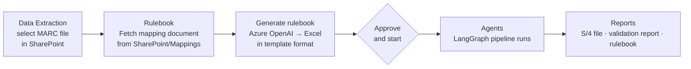
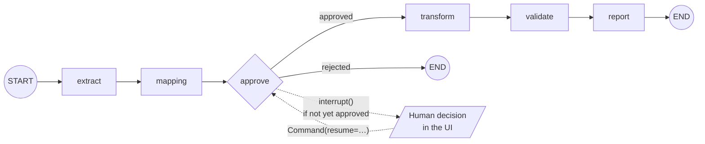

# Agentic Migration Tool: Project Summary

**Scope:** SAP ECC → S/4HANA migration of material plant data (table **MARC** → S/4 structure **S_MARC**).
**Stack:** React + Vite (JavaScript) frontend · Python FastAPI + LangGraph backend · Azure OpenAI (GPT-5) · SharePoint via Microsoft Graph.
**Status (1 Oct 2026):** working demo, tested end to end on the real SharePoint data.

---

## 1. What has been built

| Area | What it does |
|---|---|
| **SharePoint connection** | Signs in to Microsoft Graph with the app registration (client credentials), browses any folder of the document library, downloads files, and caches parsed tables as Parquet so a 25 MB workbook is parsed only once per version. |
| **Data Extraction tab** | You pick the ECC file (e.g. `MARC_DAP 8.10.26.XLSX`) from SharePoint. Only then is it loaded, with a paged preview, material search, and main/all columns. |
| **Rulebook tab** | You **Fetch** a mapping document from the SharePoint `Mappings` folder (PDF, Word or text) and its text is shown. **Generate rulebook** creates the mapping Excel in the `MARC_MBEW_Mappings.xlsx` template format and shows it on the right. **Approve and start** begins processing. |
| **Agents tab** | A 6-step progress bar, one card per agent with its status and a one-line result, an approval card (only when one is needed), and the validation result. It updates live. |
| **Runs tab** | A list of all runs: when, which files, status, validation result, S/4 row count and duration. |
| **Approvals tab** | Every approval: who, when, which document. |
| **Reports tab** | Headline figures, downloads (S/4 load file, validation report, rulebook) and the validation checks. |

Removed on purpose to keep the demo simple: settings page, live log, engine details, chat box, second approval gate (G2), run comparison, rule editing, and publishing to SharePoint.

---

## 2. Application flow



1. **Select the ECC file.** Data Extraction → *Select file* → browse SharePoint → pick `MARC_DAP 8.10.26.XLSX`. The preview loads after the pick. The chosen file is remembered while you move between tabs.
2. **Fetch the mapping document.** Rulebook → *Fetch* opens `Mappings/` → pick `Mappings for MARC.pdf`. The text is extracted (`pypdf` for PDF; Word and text files are also supported) and shown.
3. **Generate the rulebook.** The Rulebook agent turns the text into structured plant rules and writes them into the template workbook. The preview shows the main columns; the cells written from the document are highlighted.
4. **Approve and start.** The rulebook is marked approved (name and time recorded) and a run is started for the selected ECC file. The app switches to Agents.
5. **Processing.** The LangGraph pipeline runs the six steps (section 3). The page updates live through a Server-Sent Events stream.
6. **Reports.** When the run completes, the S/4 load file, the validation report and the rulebook can be downloaded.

### The mapping document used

`SharePoint/Mappings/Mappings for MARC.pdf`:

| Type | ECC plant → S/4 plant(s) |
|---|---|
| Split | 1021 → US27, US30 · 1028 → US28, US30 · 1030 → US32, US33 |
| One-to-one | 1025 → US29 · 1029 → CA02 |
| Any other plant | kept with its ECC value, flagged as unmapped, **not** put in the load file |

The lines describing plant groups ("Manufacturing plants → US27, US28, US32", "DC plants → …") are treated as context, not as rules.

---

## 3. How LangGraph works in this tool

### Graph



Code: `backend/app/graph/pipeline.py` (nodes and graph), `backend/app/graph/runner.py` (execution).

| Node | UI step | Agent card | What it does |
|---|---|---|---|
| `extract` | Fetch data | Extraction | Downloads (or reads from cache) the selected ECC file from SharePoint; records the row count. |
| `mapping` | Rulebook | Rulebook | Loads the approved rulebook (structured plant rules) and links it to the run. |
| `approve` | Approve | Approval (gate) | Passes at once if the rulebook was approved in the Rulebook tab; otherwise pauses the graph with `interrupt()` until someone approves or rejects. |
| `transform` | Transform | Transformation | Applies the plant rules and builds the S_MARC rows (section 4). |
| `validate` | Validate | Validation | Compares plant 1021 with the Databricks output (section 5). |
| `report` | Report | Reporting | Writes the S_MARC load file, the validation report and a copy of the rulebook. |

### Key design points

- **State is small.** The graph state only carries `run_id` (and a `rejected` flag). Large data (29k ECC rows, 51k S/4 rows) never goes through the graph; nodes read and write Parquet and Excel files in `backend/data/runs/<run_id>/`.
- **Human in the loop.** `approve` calls LangGraph's `interrupt()`. The graph stops and its checkpoint is saved. The UI's Approve button calls `POST /api/runs/{id}/gates/G1/decision`, and the runner resumes the graph with `Command(resume=decision)`.
- **Checkpointing.** `SqliteSaver` (`backend/data/checkpoints.sqlite`) with `thread_id = run_id`. A paused run can be resumed even after a backend restart. Runs that were mid-step during a restart are marked failed at startup.
- **Background execution.** `runner.py` runs each invocation in a thread pool (2 workers), so the API stays responsive while a run is processing.
- **Progress reporting.** A wrapper around every node marks the step *running → done/failed* in `run.json` and appends an event to `events.jsonl`. `GET /api/runs/{id}/events` streams those events over SSE, and the frontend refreshes the run whenever one arrives. It also polls every 10 s as a fallback.
- **Run record.** `run.json` holds the status, steps, approval, metrics, validation result and output files. On Windows, reads and writes retry briefly so a page refresh cannot collide with a save.

---

## 4. Rulebook generation and transformation

### Rulebook agent (`backend/app/rulebook/`)

1. **Read** the document text from SharePoint (`source.read_document`).
2. **Parse with Azure OpenAI (GPT-5).** A system prompt asks for JSON only, in a fixed schema: `splits`, `one_to_one`, `unmapped_policy`, `checks`, `notes`.
3. **Validate** the JSON with Pydantic. A split needs at least two targets with no duplicates, and a plant can't be both split and one-to-one. If the answer is invalid, the model is asked once more with the error; if it is still invalid, the step fails instead of guessing.
4. **Cross-check** the model's rules against a deterministic line-by-line scan of the same text. Any difference is recorded. For `Mappings for MARC.pdf` they agree.
5. **Write the Excel.** The template's MARC sheet is copied unchanged, and only the WERKS row's *Rule logic* cells (L3:L11) are written from the rules and shaded. Two sheets are added: **Plant Rules** (a structured table) and **Rule Source** (document, model, time, cross-check).

Without an LLM (`LLM_PROVIDER=none`) the deterministic scan is used on its own.

### Transformation (`backend/app/engine/transform.py`)

- ECC headers are screen labels ("Plant", "Procurement type"). They are mapped to SAP field names (WERKS, BESKZ) with `sap_labels.yaml`.
- **WERKS:** each ECC row is copied once per target plant for split plants, re-coded for one-to-one plants, or kept and flagged `unmapped` for plants without a rule.
- **Other S_MARC fields**, taken from the template's rule type:
  - *Passthrough* copies the ECC value.
  - *Hardcoded* writes the constant (e.g. KOKRS = `CG01`, or blank).
  - *Derived* (other than WERKS) is passed through for the demo; the derivation logic is not implemented yet.
- Each row keeps its lineage (source row, source plant, status) for validation. Lineage columns are not written to the load file.

**Result on the real extract:** 29,387 ECC rows → **51,308 S/4 rows** in the load file; 1,609 rows in 8 plants have no rule and are held back.

---

## 5. Validation rules and how the evaluation is done

Validation runs for **one plant (1021)** and compares our S_MARC rows for that plant with the Databricks output in SharePoint:
`Databricks Files/S_MARC#FreeText - 1021.csv` (9,371 rows).

### How rows are matched

- A row's **key** is *material number + S/4 plant*, for example `100014|US30`.
- Material numbers are compared **without leading zeros**, because Databricks pads them to 18 digits (`000000009687900109`) and ECC does not.
- Only our rows that come from ECC plant 1021 and go into the load file are compared.

### The four checks

| # | Check | Rule | Pass mark | Result (real data) |
|---|---|---|---|---|
| 1 | **Databricks file found** | The Databricks file for plant 1021 exists and has rows | file present | ✅ 9,371 rows |
| 2 | **Same S/4 plants** | The S/4 plants in the Databricks file are exactly the ones our rules give plant 1021 | exact match | ✅ both US27, US30 |
| 3 | **Databricks rows found in our output** | Share of Databricks rows whose key also exists in our output | ≥ 95% | ✅ **98%** (9,183 of 9,371) |
| 4 | **Key field values match** | On the rows found, each key field has the same value in both files | ≥ 99% per field | ✅ all ≥ 99.8% |

Fields compared in check 4: **DISMM** (MRP type), **DISPO** (MRP controller), **MMSTA** (plant status), **KOKRS** (controlling area), **XCHPF** (batch management).

The run passes when all four checks pass. The pass marks are settings (`MATCH_PASS_MARK=0.95`, `FIELD_PASS_MARK=0.99`).

### What the 98% means, in plain terms

Databricks made 9,371 rows for plant 1021. We found 9,183 of them in our output with the same material and plant. The other ~188 (2%) use material numbers that are not in the ECC 1021 extract as-is, most likely because Databricks re-numbers some materials. This has not been confirmed.

### Checks deliberately left out for now, and why

| Check | Why it is not used yet |
|---|---|
| Row count equal to Databricks | We produce 28,964 rows for 1021 and Databricks has 9,371. Databricks also removes deleted materials (`LVORM`) and only splits some rows (by procurement type BESKZ/SOBSL). Our rules split every row, so this check cannot pass until those rules are added. |
| Duplicate material + plant | Plants 1021 and 1028 both map to **US30**, so 3,608 materials get two US30 rows in the load file. |
| Unmapped plants | 8 plants (1000, 1031–1035, 1041, 1055) have no rule; they are held back rather than failing the run. |
| Other derived fields | Fields like MTVFP, PRCTR and EKGRP have derivation logic that is not implemented yet, so they would not match Databricks. |

### Outputs of a run

| File | Contents |
|---|---|
| `S_MARC_<run>.xlsx` | Load file: a description row, a field-name row, then all mapped rows (146 fields). |
| `Validation_Report_<run>.xlsx` | Sheets: *Summary*, *Checks*, *Field comparison*, *Not found* (the Databricks rows we did not produce). |
| `MARC_Mapping_<id>.xlsx` | The approved rulebook in template format. |

---

## 6. Where things are

```
Agentic Tool/
├─ start.bat                    starts backend (8010) + frontend (5180)
├─ backend/
│  ├─ .env                      SharePoint + Azure OpenAI settings (not to be shared)
│  └─ app/
│     ├─ connectors/            sharepoint.py (Graph), source.py (browse, tables, documents, cache)
│     ├─ llm/azure.py           Azure OpenAI client
│     ├─ rulebook/              parser.py, writer.py, service.py
│     ├─ engine/                transform.py, validate.py, outputs.py
│     ├─ graph/                 pipeline.py (LangGraph), runner.py
│     ├─ store/runs.py          run records and events
│     └─ main.py                REST API + SSE
├─ frontend/src/pages/          Extraction, Rulebook, Agents, Runs, Approvals, Reports
├─ templates/                   MARC_MBEW_Mappings.xlsx (format template)
└─ local_sharepoint/            offline copy laid out like the library (SOURCE_MODE=local)
```

**Run it:** start the backend, then the frontend, in two terminals (see README.md), then open http://localhost:5180.

---

## 7. Further to-dos

### Make the numbers line up with Databricks
- [ ] Add the **filters** from the template: `MARA.LVORM IS NULL`, `MARA.MTART <> 'NVAL'`, `MARC.LVORM IS NULL`. This needs MARA from SharePoint as a second input.
- [ ] Add the **conditional split** for 1021 / 1028 / 1030 (by SFCPF, BESKZ, SOBSL, LGFSB), so not every row goes to both plants. After that, turn the **row count** check back on.
- [ ] Find out why ~2% of Databricks 1021 materials are not in the ECC extract (a material renumbering table, MATNR_new?).
- [ ] Settle plant **1028 → US30 or US31**. The real S/4 output uses US31, and this also removes the US30 duplicates.

### Extend the rules and validation
- [ ] Implement the other **derived fields** (MTVFP, MMSTA, AUSME, BSTMI/BSTMA/BSTFE, EKGRP, …) from the template logic, and add them to the field comparison.
- [ ] Validate **all plants** (1021, 1025, 1028, 1029, 1030), each against its own Databricks file, not only 1021.
- [ ] Bring back the **duplicate key** check once the 1028 target is settled.
- [ ] Decide what happens to the **8 plants without a rule** (add rules, or exclude them explicitly).

### Product features
- [ ] **MBEW** (valuation data) using the same flow; the template sheet and Databricks files already exist.
- [ ] **Publish outputs to SharePoint** (e.g. an `Outputs/<run>` folder). The connector has the Graph access; the button was removed for the demo.
- [ ] Bring back a second approval step (**G2**) for business decisions when a check fails, e.g. unmapped plants.
- [ ] User sign-in (Azure AD) so approvals record the real user instead of a typed name.
- [ ] Let the rulebook read **all** template fields from the document, not only WERKS.

### Engineering
- [ ] Automated tests for the parser, transform and validation, using a small fixture extract.
- [ ] Move run storage from JSON files to a database (SQLite or Postgres) for multi-user use.
- [ ] Faster load-file writing (currently ~30 s for 51k rows × 146 fields).
- [ ] Deployment: containerise the backend and frontend, put secrets in Key Vault instead of `.env`.
